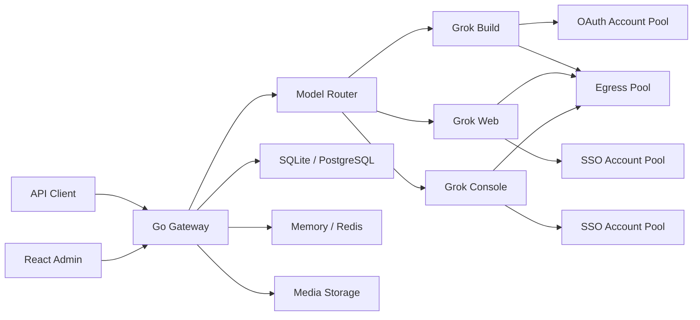

<p align="center">
  
</p>

<p align="center">
  <strong>面向 Grok Build、Grok Web 与 Grok Console 的多账号 API 网关</strong>
</p>

<p align="center">
  <a href="./backend/go.mod"></a>
  <a href="./frontend/package.json"></a>
  <a href="https://github.com/owen891/grok2api/actions/workflows/ghcr-image.yml"></a>
</p>

<p align="center">
  基于 <a href="https://github.com/chenyme/grok2api">chenyme/grok2api</a> 的二开版本
</p>

> [!NOTE]
> 本项目仅供学习与研究交流。请务必遵循 Grok 的使用条款及当地法律法规，不得用于非法用途！

Grok2API 是一个纯 Go 实现的 Grok API 网关。本二开版本在原有多 Provider 网关基础上，继续补齐了注册体系、聊天工作区、Grok Web 浏览器链路、媒体任务和一体化管理后台。项目将 Grok Build OAuth、Grok Web SSO 与 Grok Console SSO 组织为独立账号池，对外提供 OpenAI 风格接口、Anthropic Messages 兼容接口，以及账号、模型、密钥、用量、代理和注册流程管理能力。

## 功能概览

- **三 Provider 网关**：`grok_build`、`grok_web` 与 `grok_console` 独立路由、额度隔离、故障状态与模型映射
- **标准兼容接口**：Responses、Chat Completions、Images、异步 Videos、Anthropic Messages
- **多账号调度**：优先级、并发限制、额度门控、会话粘滞、冷却、恢复与故障切换
- **账号接入与转换**：Device OAuth、OAuth JSON、SSO JSON、逐行 SSO Token，以及 Web SSO 到 Build 的转换链路
- **注册体系**：内置协议/浏览器双引擎注册控制器、CPA/OIDC 导出、结果接管和后台管理入口
- **聊天与操作台**：前端内置 Chat 工作区、注册页、图库页、视频图库页和 API 文档页
- **媒体能力**：图片生成、图片编辑、视频生成、图片任务归档与 URL/Base64 返回
- **Web 浏览器链路**：持久 Chromium 会话、browser worker、Statsig 预热与签名缓存、辅助校验适配
- **基础设施**：SQLite/PostgreSQL、Memory/Redis、HTTP 与 SOCKS 代理池
- **安全边界**：AES-256-GCM 凭据加密、客户端密钥哈希、日志脱敏、SSRF 与传输上限，以及注册凭据的私有原子落盘

## 二开重点

相比上游版本，这个二开分支重点补充了下面几类能力：

1. **注册流程正式并入主系统**：新增 `registration/` 模块、后端注册控制器、前端注册页面，以及 Docker/Compose 运行入口，注册、导出、接管和导入不再依赖仓库外的零散脚本。
2. **聊天工作区落地到管理台**：新增完整的 Chat 页面、会话存储、SSE 处理、消息渲染、图片灯箱和参数控制，管理端不再只是配置后台，也可以直接验证对话链路。
3. **Grok Web 浏览器链路增强**：增加 browser worker、持久浏览器会话、Statsig 预热与签名、辅助校验逻辑以及 Fast 生图相关配套链路，强化 Web 侧的可用性和稳定性。
4. **媒体与任务能力扩展**：补充图片任务处理、图库页、视频图库页、视频任务查询和更多前后端联动能力，方便围绕生成结果做统一管理。
5. **部署与公开协作更完整**：新增注册容器入口、外部节点辅助脚本，并补齐 `.gitignore` 规则，默认排除 `config.yaml`、运行日志、cookies、调试抓取结果和本地构建产物。

## 架构



## 快速部署

### Docker Compose

1. 准备配置：

```bash
git clone https://github.com/owen891/grok2api.git
cd grok2api
cp config.example.yaml config.yaml
cp .env.example .env
```

2. 生成并填写安全密钥：

```bash
openssl rand -hex 32
openssl rand -base64 32
```

```yaml
secrets:
  jwtSecret: "替换为 hex 随机值"
  credentialEncryptionKey: "替换为 Base64 随机密钥"

bootstrapAdmin:
  username: "admin"
  password: "替换为强密码"
```

3. 按实际使用的注册模式启动。只启动需要的组合，避免同时下载两套浏览器运行时：

```bash
# 不使用自动注册
docker compose pull
docker compose up -d

# 协议注册：标准应用镜像 + Turnstile solver
docker compose -f docker-compose.yml -f compose.registration.yml pull
docker compose -f docker-compose.yml -f compose.registration.yml up -d

# 浏览器注册：预构建 browser 镜像，不启动协议 solver
docker compose -f docker-compose.yml -f compose.browser-registration.yml pull
docker compose -f docker-compose.yml -f compose.browser-registration.yml up -d
```

访问 `http://127.0.0.1:8000`。

使用当前源码构建镜像时执行：

```bash
docker compose build
docker compose up -d
```

`docker compose pull` 使用官方镜像；`docker compose build` 才会包含当前工作树的后端、前端和注册 worker 改动。

注册 worker 的服务器代理通过 Compose 环境变量配置：直连时保持 `REGISTRATION_PROXY=`；宿主机代理使用 `http://host.docker.internal:PORT`；Compose 内代理使用服务名。也可以设置 `REGISTRATION_PROXY=system`，并提供 `REGISTRATION_HTTPS_PROXY`、`REGISTRATION_HTTP_PROXY` 或 `REGISTRATION_ALL_PROXY`。这些注册专用变量不会改变其他 Provider 的出口。容器内的 `127.0.0.1` 指向容器自身，不代表服务器宿主机。

浏览器注册使用单独的 `main-browser` 预构建镜像，包含 Chromium、Xvfb、DrissionPage、注册脚本和 Turnstile 扩展。普通服务器部署只执行上面的 `pull/up`。开发当前工作树时才执行：

```bash
docker compose -f docker-compose.yml -f compose.browser-registration.yml build grok2api
docker compose -f docker-compose.yml -f compose.browser-registration.yml up -d
```

然后在注册设置中将 `engine` 切为 `browser`。容器以 `DISPLAY=:99` 启动 Xvfb，并用非 headless Chromium 后台运行。HTTP(S) 认证代理由临时 MV3 扩展处理；认证 SOCKS 代理必须先经本地 relay 转成无认证端口。Browser preflight 会通过同一注册代理检查出口 IP、注册页和邮箱 API；出口检查默认使用 `https://api64.ipify.org?format=json`，可用 `REGISTRATION_PREFLIGHT_EGRESS_URL` 覆盖。需要在管理端随时切换协议与浏览器引擎时，同时加载 `compose.registration.yml` 和 `compose.browser-registration.yml`；此时才会下载两套运行时。

Browser 注册支持与 Protocol 相同的账号类型选择。`Build` 在同一注册线程内完成 OAuth、CPA hotload 和首次同步；`Web` 读取 SSO 后写入 `grok_web` 凭据、导入并完成首次同步，可选 `autoNSFW`。每个已拿到 SSO 的账号最多按 `cpa_mint_retry_attempts` 重试；耗尽后凭据写入数据目录下权限受限的 `browser_pending_oauth.json`，下次相同账号类型的 browser run 会优先 resume，不会重新注册替代账号。收到 `SIGINT`/`SIGTERM` 后 worker 会停止领取新账号、保留已注册账号的 pending 凭据状态并回收浏览器。`browser_state.json` 的 `resumable` 表示当前账号类型待恢复数量；`browser_metrics.json` 只保存阶段和资源统计，不写密码、SSO 或 Cookie。

官方镜像已经包含前端构建产物，管理端与 API 由同一个 Go 服务提供。Compose 默认将 `config.yaml` 只读挂载到容器，并使用 `grok2api-data` 命名卷保存 SQLite 数据库和本地媒体。

Compose 同时启动 `grok-web-browser` 服务为 Basic 账号的 Fast 生图保持持久 Chromium 会话。Go 服务仍负责账号调度、额度和图片归档，Grok REST 与 Statsig 签名请求在同一浏览器、代理出口和 Cookie Jar 中完成。服务启动时会用一个启用的 Web 账号和实际出口预热 Grok 页面及 Statsig，`/healthz` 检查 worker 进程，`/readyz` 仅在浏览器会话完成初始化后返回成功。管理端 `grok_web` 节点如果使用宿主机 `127.0.0.1` 代理，worker 会在容器内映射为 `host.docker.internal`。源码运行时可在 `provider.web.browserWorkerURL` 配置 `http://127.0.0.1:8192`。Compose 默认固定到已验证的 FlareSolverr v3.5.0 镜像 digest，可通过 `FLARESOLVERR_IMAGE` 显式覆盖。

Basic 账号的 `grok-imagine-image` Fast 路由只承诺提示词、数量和 `1:1`/`1k` 默认规格；其他宽高比或 `2k` 会返回参数错误，不会静默生成默认规格。需要这些规格时启用 `grok-imagine-image-quality` 并使用支持的账号额度。

## 部署教程

下面的流程适用于从 GitHub 拉取仓库后的新机器。生产部署优先使用 GHCR 预构建镜像，普通升级只拉取镜像；源码构建适合开发和修改代码后的本地验证。

### 1. 准备环境

安装 Docker Engine 或 Docker Desktop，并确认 Compose v2 可用：

```bash
docker version
docker compose version
```

拉取仓库并进入目录：

```bash
git clone https://github.com/owen891/grok2api.git
cd grok2api
```

### 2. 单机部署

单机路径使用 SQLite、Memory 和本地媒体目录，适合个人使用或单实例部署：

```bash
cp config.example.yaml config.yaml
cp .env.example .env
mkdir -p data
```

编辑 `config.yaml`：

```yaml
secrets:
  jwtSecret: "至少 32 个字符的随机值"
  credentialEncryptionKey: "Base64 编码的 32 字节密钥"

bootstrapAdmin:
  username: "admin"
  password: "强管理员密码"

frontend:
  publicApiBaseURL: "https://你的域名"

auth:
  secureCookies: true

registration:
  enabled: true
```

纯内网 HTTP 部署可将 `publicApiBaseURL` 写为服务器地址并保持 `secureCookies: false`；通过 HTTPS 域名访问时使用上面的配置。

启动基础 API：

```bash
docker compose pull
docker compose up -d
```

访问 `http://服务器地址:8000`，使用 `bootstrapAdmin` 登录。服务器防火墙放行 `8000`，公网部署建议通过 HTTPS 反向代理转发。

### 3. 选择注册引擎

注册引擎对应不同的预构建应用镜像。先选择一种，后续切换时再重新组合 Compose 文件。

协议注册：

```bash
docker compose -f docker-compose.yml -f compose.registration.yml pull
docker compose -f docker-compose.yml -f compose.registration.yml up -d --force-recreate
```

协议模式使用 `http://grok-turnstile-solver:5072`，管理端的“清障服务地址”保持该地址。协议 solver 是独立容器，应用容器内不调用 Docker CLI。

浏览器注册：

```bash
docker compose -f docker-compose.yml -f compose.browser-registration.yml pull
docker compose -f docker-compose.yml -f compose.browser-registration.yml up -d --force-recreate
```

浏览器模式使用 `main-browser` 镜像，镜像内包含 Chromium、Xvfb、DrissionPage、注册脚本和 Turnstile 扩展。进入管理端“注册”，将 `engine` 设为“浏览器注册”，保存后执行“预检”。

需要在管理端来回切换两种引擎时：

```bash
docker compose -f docker-compose.yml \
  -f compose.registration.yml \
  -f compose.browser-registration.yml pull
docker compose -f docker-compose.yml \
  -f compose.registration.yml \
  -f compose.browser-registration.yml up -d --force-recreate
```

单独使用浏览器注册时，使用 browser overlay；单独使用协议注册时，使用 registration overlay。生产环境执行 `pull/up`，避免执行 `up --build` 触发现场构建。

### 4. 生产部署

多实例或正式服务使用 `deploy_artifact` 中的 PostgreSQL、Redis 和预构建应用镜像：

```bash
cd deploy_artifact
cp .env.production.example .env
cp config.production.example.yaml config.production.yaml
```

在 `.env` 和 `config.production.yaml` 中设置相同的 PostgreSQL 密码，替换所有 `replace-with` 和 `change-me`，然后选择：

```env
# protocol、browser、both、none
REGISTRATION_RUNTIME=protocol
```

启动：

```bash
sh ./install.sh
```

Windows PowerShell：

```powershell
.\install.ps1
```

安装脚本会根据 `REGISTRATION_RUNTIME` 组合 Compose 文件：

| 值 | 运行时 |
| --- | --- |
| `protocol` | 标准应用镜像 + protocol solver |
| `browser` | `main-browser` 应用镜像 |
| `both` | `main-browser` 应用镜像 + protocol solver |
| `none` | 标准应用镜像 |

### 5. 首次使用

1. 使用 `bootstrapAdmin` 登录管理端。
2. 在“设置”中确认出口代理、媒体目录和上游服务配置。
3. 在“上游账号”中导入 Grok Build、Grok Web 或 Grok Console 账号。
4. 在“模型管理”中确认模型已同步并处于启用状态。
5. 在“客户端密钥”中创建 `g2a_` API Key。
6. 使用 API Key 调用 `/v1/models` 和 `/v1/responses`。

示例：

```bash
curl http://127.0.0.1:8000/v1/models \
  -H "Authorization: Bearer g2a_xxx_xxx"

curl http://127.0.0.1:8000/v1/responses \
  -H "Authorization: Bearer g2a_xxx_xxx" \
  -H "Content-Type: application/json" \
  -d '{"model":"grok-chat-auto","input":"你好"}'
```

### 6. 升级、回滚和排查

升级前备份 `config.yaml`、`data` 或 PostgreSQL 数据卷。升级时复用首次部署选择的 Compose 文件组合；生产部署可直接重新运行 `install.sh` 或 `install.ps1`。基础单机模式执行：

```bash
docker compose pull
docker compose up -d --force-recreate
```

协议或浏览器模式升级时，命令中继续带上对应的 `compose.registration.yml` 或 `compose.browser-registration.yml`。

查看状态和日志：

```bash
docker compose ps
docker compose logs --tail=200 grok2api
docker compose logs --tail=100 grok-turnstile-solver
```

注册页预检失败时，先检查对应容器：

```bash
docker compose ps grok2api grok-turnstile-solver
docker compose exec grok2api sh -lc '/opt/registration-venv/bin/python -c "import DrissionPage"'
docker compose exec grok2api sh -lc 'command -v chromium; test -f /app/registration/register_cli.py'
```

常见日志与处理方式：

| 日志 | 处理 |
| --- | --- |
| `docker command not found` | 将 endpoint 设置为 `http://grok-turnstile-solver:5072`，并启动 protocol overlay |
| `register_cli.py: No such file` | 使用 `main-browser` 镜像，重建容器时带 browser overlay |
| `No module named DrissionPage` | 旧 runtime 部署需追加 `compose.browser-registration.legacy.yml`，并重新拉取 browser 镜像 |
| `Chromium ... not found` | 当前仍在运行标准 protocol 镜像，拉取并切换 `main-browser` |
| `DISPLAY is empty and Xvfb is unavailable` | 浏览器模式需使用 `REGISTRATION_BROWSER_MODE=xvfb` 的 browser overlay |
| `v3.0.9` 点击“检查更新”仍显示 `v3.0.9` | 该版本会优先读取镜像内旧清单，需先按原 Compose 文件组合执行一次 `pull` 和 `up -d --force-recreate`；升级到 `v3.1.0` 后恢复远端检查 |

修改源码后的本地镜像构建：

```bash
docker compose build
docker compose up -d
```

浏览器源码构建：

```bash
docker compose -f docker-compose.yml -f compose.browser-registration.yml build grok2api
docker compose -f docker-compose.yml -f compose.browser-registration.yml up -d
```

常用命令：

```bash
docker compose logs -f grok2api
docker compose restart grok2api
docker compose down
```

### 源码运行

后端：

```bash
cp config.example.yaml config.yaml
cd backend
go run ./cmd/grok2api
```

前端开发服务器：

```bash
cd frontend
pnpm install
pnpm dev
```

前端默认运行于 `http://127.0.0.1:5173`，并将 API 请求代理到 `http://127.0.0.1:8000`。

## 首次使用

1. 使用 `bootstrapAdmin` 配置的管理员登录。
2. 在“上游账号”中接入 Grok Build、Grok Web 或 Grok Console 账号。
3. 等待本次额度和模型能力同步完成。
4. 在“模型管理”中确认对外模型名称与启用状态。
5. 在“客户端密钥”中创建 `g2a_` API Key。
6. 使用该密钥调用 `/v1/*`。

首次管理员创建后，建议修改管理员密码并从 `config.yaml` 删除 `bootstrapAdmin` 段。`credentialEncryptionKey` 必须长期保留，更换后已有凭据将无法解密。

## 账号来源

| Provider | 认证方式 | 主要能力 |
| :-- | :-- | :-- |
| Grok Build | Device OAuth、OAuth JSON | 原生 Responses、Chat、Messages、Billing、模型同步 |
| Grok Web | SSO JSON、逐行 SSO Token | Chat、Responses、Messages、图片、图片编辑、视频 |
| Grok Console | SSO JSON、逐行 SSO Token | 无状态 Responses、兼容 Chat 与 Messages |

Grok Build OAuth 支持按需续期。Grok Web 与 Grok Console 的 SSO 不可自动续期，凭据失效后账号会退出可用号池并等待重新授权。

Grok Web 与 Grok Console 均支持账号列表 JSON，也支持每行一个 Token 的快速导入。账号接入接口会等待本批账号的首次额度与模型能力同步完成后再返回结果。

管理端可复用 Web 账号的同一份 SSO 创建或更新对应的 Console 账号；同步按 Console 身份键幂等执行，不会改变已有 Web/Build 关联。

Grok Console 固定使用 `store: false`，不支持 `previous_response_id`、Response 查询/删除或 `/responses/compact`。多轮调用应像 Codex 无状态链路一样回放完整输入、工具调用和工具结果；网关不会为 Console 响应登记虚假的持久化归属。

## 模型

对外模型名称不带 Provider 前缀，例如 `grok-4.5`。内部上游路由使用 `Build/`、`Web/`、`Console/` 前缀区分实际来源；Grok Build 模型根据账号能力动态同步，请以管理端模型页或 `GET /v1/models` 为准。

升级时会原位迁移内部路由并保留路由主键、客户端密钥权限和旧名称别名。多个来源可以提供同一个对外模型名称；网关会按客户端权限、协议能力和账号可用性选择来源。带 Provider 前缀的名称仍可作为兼容入口，用于显式指定渠道。

Grok Web 内置模型：

| 模型 | 能力 | 最低等级 |
| :-- | :-- | :-- |
| `grok-chat-fast` | Chat / Responses / Messages | Basic |
| `grok-chat-auto` | Chat / Responses / Messages | Super |
| `grok-chat-expert` | Chat / Responses / Messages | Super |
| `grok-chat-heavy` | Chat / Responses / Messages | Heavy |
| `grok-imagine-image` | Fast 图片生成 | Basic |
| `grok-imagine-image-quality` | Quality 图片生成 | Super |
| `grok-imagine-image-edit` | 图片编辑 | Super |
| `grok-imagine-video` | 视频生成 | Super |

Grok Console 内置模型：

| 模型 | 能力 |
| :-- | :-- |
| `grok-4.3` | Responses / Chat / Messages |
| `grok-4.20-0309` | Responses / Chat / Messages |
| `grok-4.20-0309-reasoning` | Responses / Chat / Messages |
| `grok-4.20-0309-non-reasoning` | Responses / Chat / Messages |
| `grok-4.20-multi-agent-0309` | Responses / Chat / Messages |
| `grok-build-0.1` | Responses / Chat / Messages |

`grok-4.5` 不由 Grok Console Provider 注册；即使由 Web SSO 同步创建 Console 账号，该模型在 Console 中仍不可用。

Console 上游路由始终使用 `Console/` 内部前缀，不再根据启动顺序生成 `-console` 冲突后缀。升级产生的兼容别名不会出现在 `GET /v1/models`。

同名模型会在当前可用来源中自动选路；来源选定后，账号故障切换只发生在该 Provider 的账号池内。

## API

除健康检查和公开图片外，所有 `/v1` 接口都需要客户端 API Key：

```http
Authorization: Bearer g2a_xxx_xxx
```

| 方法 | 路径 | 说明 |
| :-- | :-- | :-- |
| `GET` | `/healthz` | 存活检查 |
| `GET` | `/readyz` | 就绪检查 |
| `GET` | `/v1/models` | 当前可服务模型 |
| `POST` | `/v1/responses` | Responses JSON / SSE |
| `POST` | `/v1/responses/compact` | Responses compact |
| `GET` | `/v1/responses/{id}` | 查询 Response |
| `DELETE` | `/v1/responses/{id}` | 删除 Response |
| `POST` | `/v1/chat/completions` | Chat Completions JSON / SSE |
| `POST` | `/v1/messages` | Anthropic Messages JSON / SSE |
| `POST` | `/v1/images/generations` | 图片生成 |
| `POST` | `/v1/images/edits` | 图片编辑 |
| `GET` | `/v1/media/images/{id}` | 公开归档图片 |
| `POST` | `/v1/videos/generations` | 创建视频任务 |
| `GET` | `/v1/videos/{request_id}` | 查询视频任务 |

Responses 资源查询、删除和 compact 的实际可用性取决于目标模型所属 Provider；Grok Console 仅支持无状态 `POST /v1/responses`。

管理端登录后可在 `/docs` 查看当前 Base URL、可用模型以及 cURL、Python 和 JavaScript 示例。开发环境还可以在 `config.yaml` 设置 `server.swaggerEnabled: true`，通过 `/swagger/index.html` 查看公开 API 的 Swagger 文档；生产环境应保持关闭。

最小调用示例：

```bash
export GROK2API_API_KEY="g2a_xxx_xxx"

curl http://127.0.0.1:8000/v1/responses \
  -H "Authorization: Bearer $GROK2API_API_KEY" \
  -H "Content-Type: application/json" \
  -d '{
    "model": "grok-chat-auto",
    "input": "用三句话解释量子隧穿",
    "stream": true
  }'
```

## 配置与存储

根目录 `config.yaml` 保存启动配置：

| 分组 | 说明 |
| :-- | :-- |
| `server` | 监听地址、请求体上限、请求生命周期与 Swagger 开关 |
| `frontend` | 公开 API 地址与静态前端目录 |
| `database` | SQLite 或 PostgreSQL |
| `runtimeStore` | Memory 或 Redis |
| `auth` | 管理员 Token 与安全 Cookie |
| `secrets` | JWT 与凭据加密密钥 |
| `provider` | Build/Web/Console 上游默认配置 |
| `media` | 媒体存储驱动与路径 |

账号、模型、额度、审计、客户端密钥、媒体任务和运行设置始终保存在关系型数据库。Redis 用于限流、并发租约、粘滞路由、分布式锁、额度恢复事件和多实例设置通知。

推荐组合：

| 场景 | 数据库 | 运行态 | 媒体 |
| :-- | :-- | :-- | :-- |
| 本地或单实例 | SQLite | Memory | 本地目录 |
| 多实例 | PostgreSQL | Redis | 共享卷或实例亲和 |

可热加载的 Provider（包括 Console 上游地址与 User-Agent）、批量任务并发、路由、媒体容量、审计和代理参数统一在管理端 `/settings` 修改，不需要直接编辑数据库。导入同步、账号转换、数据同步和凭据刷新默认并发均为 `25`，可分别限制为 `1–50`，并支持随机启动延迟；多实例使用 Redis 时，分类上限和总上限均在集群范围内生效。

## 生产部署

- 使用 HTTPS，并设置 `auth.secureCookies: true`
- 保持 `server.swaggerEnabled: false`
- 多实例部署使用 PostgreSQL 与 Redis
- 本地媒体目录在多实例下必须使用共享卷或实例亲和
- 持久化备份 `config.yaml`、关系型数据库和媒体目录
- 不要将 OAuth、SSO、Cloudflare Cookie 或账号导出文件提交到 Git
- 运行期敏感文件已默认加入 `.gitignore`，包括 `config.yaml`、`data/`、本地日志、cookies、调试抓取结果和本地构建产物
- 对外暴露前建议配置反向代理、访问日志和基础网络防护

## 开发

后端：

```bash
cd backend
go test ./...
go test -race ./...
go vet ./...
go build ./cmd/grok2api
```

前端：

```bash
cd frontend
pnpm install --frozen-lockfile
pnpm lint
pnpm build
```

## 进一步阅读

- [后端说明](./backend/README.md)
- [前端说明](./frontend/README.md)
- [Provider 架构与维护边界](./backend/docs/PROVIDER_ARCHITECTURE.md)
- [API 与协议兼容范围](./backend/docs/RESPONSES_COMPATIBILITY.md)
